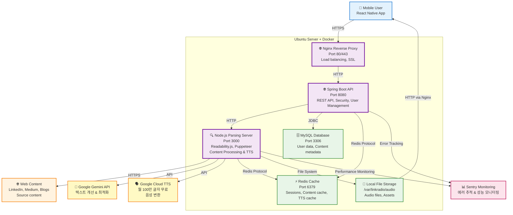
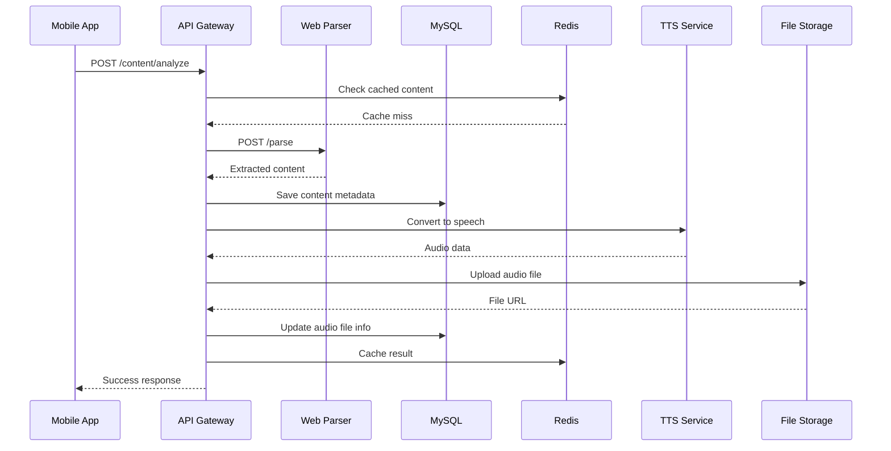
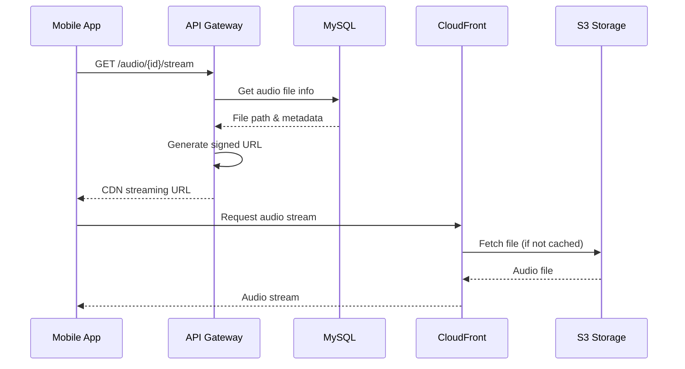
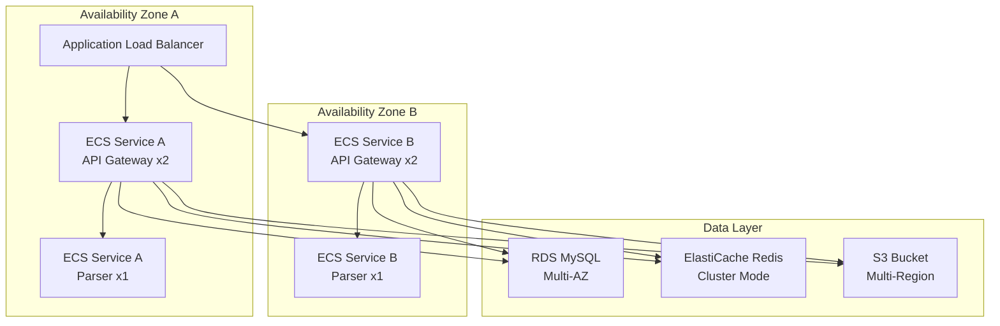
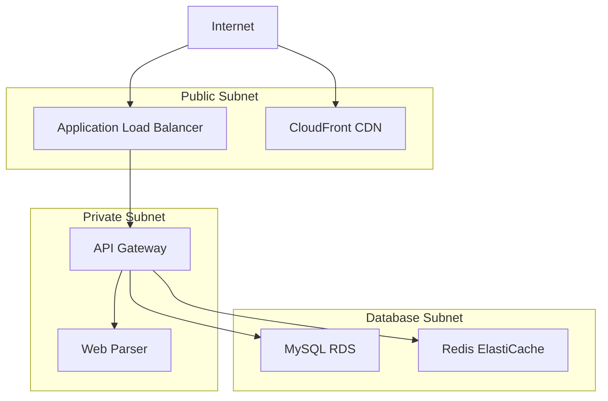

# C4 Model: Container Diagram

## 📋 개요

이 문서는 LinkRadio 시스템의 **Container Diagram**을 제공합니다. 이는 C4 모델의 두 번째 레벨로, 시스템 내부의 주요 컨테이너(애플리케이션, 데이터 저장소, 마이크로서비스)와 이들 간의 상호작용을 보여줍니다.

## 🎯 목적

- 시스템의 고수준 기술 구조 이해
- 컨테이너 간 통신 패턴 파악
- 기술 스택과 배포 경계 명확화
- 확장성 및 운영 관점 제공

## 🏗️ Container Diagram



## 📦 컨테이너 상세 명세

### 1. API Gateway (Spring Boot)

**기술 스택**:
- **Runtime**: Java 17 + Spring Boot 3.5
- **Framework**: Spring Web MVC, Spring Security
- **Port**: 8080
- **Database**: Spring Data JPA
- **Cache**: Spring Data Redis

**책임**:
- REST API 엔드포인트 제공
- JWT 기반 인증/인가
- Rate limiting 및 요청 검증
- 비즈니스 로직 처리
- 외부 서비스 오케스트레이션

**핵심 API 엔드포인트**:
```yaml
# User Management
POST   /api/v1/auth/login
GET    /api/v1/users/profile

# Content Processing
POST   /api/v1/content/analyze
GET    /api/v1/content/{id}

# Audio Management
GET    /api/v1/audio/{id}/stream
POST   /api/v1/playlists
```

### 2. Web Parsing Server (Node.js)

**기술 스택**:
- **Runtime**: Node.js 18 + Express.js
- **Libraries**: @mozilla/readability, puppeteer, jsdom
- **AI Integration**: Google Gemini API, Google Cloud TTS
- **Monitoring**: Sentry SDK
- **Port**: 3000

**책임**:
- 웹 페이지 콘텐츠 추출 및 파싱
- JavaScript 렌더링 (Puppeteer)
- Gemini API를 통한 텍스트 최적화
- Google Cloud TTS를 통한 음성 변환
- 오디오 파일 로컬 저장
- 성능 및 에러 모니터링

**API 인터페이스**:
```javascript
// POST /api/v1/process-content
{
  "url": "https://example.com/article",
  "options": {
    "timeout": 30000,
    "waitUntil": "networkidle2",
    "voice": "ko-KR-Wavenet-A",
    "speakingRate": 1.0
  }
}

// Response
{
  "success": true,
  "data": {
    "title": "Article Title",
    "content": "Extracted text...",
    "improvedText": "AI-optimized text for speech...",
    "audioUrl": "/audio/generated_123456.mp3",
    "wordCount": 1250,
    "duration": 320,
    "author": "Author Name",
    "processingTime": 15000
  }
}

// Error Response with Sentry tracking
{
  "success": false,
  "error": "Content extraction failed",
  "errorId": "sentry-error-id-123",
  "retryable": true
}
```

### 3. Primary Database (MySQL)

**기술 스택**:
- **Engine**: MySQL 8.0
- **Features**: InnoDB, Full-text search
- **Port**: 3306
- **Deployment**: AWS RDS (Multi-AZ)

**주요 테이블**:
```sql
-- Core entities
users                 # 사용자 정보
content               # 콘텐츠 메타데이터
audio_files           # 오디오 파일 정보
playlists            # 플레이리스트
playlist_items       # 플레이리스트 아이템
user_activity        # 사용자 활동 로그
processing_jobs      # 비동기 작업 큐
```

**성능 최적화**:
- 읽기 전용 복제본 (Read Replica)
- 인덱스 최적화
- 쿼리 캐싱

### 4. Cache Layer (Redis)

**기술 스택**:
- **Engine**: Redis 7.0
- **Deployment**: AWS ElastiCache
- **Port**: 6379

**사용 패턴**:
```yaml
# Session Management
"session:{userId}": "JWT token data"

# Content Cache
"content:{urlHash}": "Parsed content"

# Rate Limiting
"rateLimit:{clientId}": "request count"

# Job Queue
"queue:tts": ["job1", "job2", "job3"]
```

**캐시 전략**:
- **Write-Through**: 실시간 업데이트
- **TTL**: 콘텐츠별 차등 적용
- **Eviction**: LRU 정책

### 5. File Storage (AWS S3)

**구조**:
```
linkradio-audio-bucket/
├── audio/
│   ├── 2025/01/15/user123_content456.mp3
│   └── 2025/01/15/user123_content456.json (metadata)
├── thumbnails/
│   └── content456.jpg
└── temp/
    └── processing/
```

**액세스 패턴**:
- **업로드**: API Gateway → S3 (Multipart)
- **다운로드**: CDN → S3 → User
- **생명주기**: 자동 삭제 정책 (90일)

### 6. Content Delivery Network (CloudFront)

**배포 설정**:
- **Origins**: S3 Bucket
- **Behaviors**: Audio streaming 최적화
- **Caching**: Edge locations에서 24시간 캐시
- **Security**: Signed URLs로 접근 제어

## 🔄 컨테이너 간 통신 패턴

### 1. 콘텐츠 변환 플로우



### 2. 오디오 스트리밍 플로우



## 🚀 배포 아키텍처

### Development Environment

```yaml
version: '3.8'
services:
  api-gateway:
    build: .
    ports: ["8080:8080"]
    depends_on: [mysql, redis]

  web-parser:
    build: ./parsing-server
    ports: ["3000:3000"]

  mysql:
    image: mysql:8.0
    environment:
      MYSQL_ROOT_PASSWORD: dev_password

  redis:
    image: redis:7-alpine
```

### Production Environment (AWS)



## 📊 성능 및 확장성

### 확장 포인트

| 컨테이너 | 확장 방법 | 제약 사항 |
|----------|-----------|-----------|
| **API Gateway** | 수평 확장 (Auto Scaling) | Stateless 설계 |
| **Web Parser** | 수평 확장 + 큐잉 | 브라우저 리소스 |
| **MySQL** | 읽기 복제본, 샤딩 | 쓰기 병목 |
| **Redis** | 클러스터 모드 | 메모리 제한 |
| **S3** | 자동 확장 | 비용 최적화 필요 |

### 성능 지표

```yaml
# API Gateway
Response Time: < 500ms (95th percentile)
Throughput: 1000 RPS
Availability: 99.9%

# Web Parser
Processing Time: < 30s per article
Concurrency: 10 parallel requests
Success Rate: > 90%

# Database
Read Latency: < 10ms
Write Latency: < 50ms
Connection Pool: 20 connections

# Cache
Hit Ratio: > 80%
Latency: < 1ms
Memory Usage: < 80%
```

## 🔐 보안 구성

### 네트워크 보안


### 접근 제어
- **API Gateway**: JWT + Role-based access
- **Database**: IAM + VPC Security Groups
- **S3**: Bucket policies + Signed URLs
- **Redis**: AUTH + VPC isolation

## 🔍 모니터링 및 관찰성

### 로깅 전략
```yaml
# API Gateway
- Request/Response logs
- Business logic errors
- Performance metrics

# Web Parser
- Parsing success/failure
- Processing time
- Browser resource usage

# Infrastructure
- Container health
- Resource utilization
- Network traffic
```

### 메트릭 수집
```yaml
# Application Metrics
- api.request.duration
- parser.processing.time
- tts.conversion.success_rate

# Infrastructure Metrics
- cpu.utilization
- memory.usage
- disk.io

# Business Metrics
- content.conversion.count
- user.engagement.rate
- audio.streaming.duration
```

---

*문서 버전: 1.0*
*마지막 업데이트: 2025-09-28*
*검토자: Backend Architect*