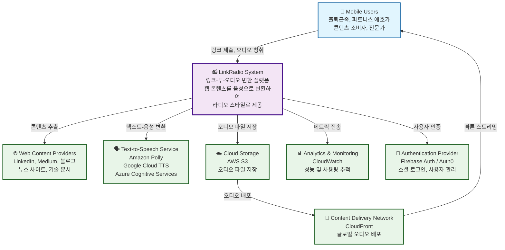
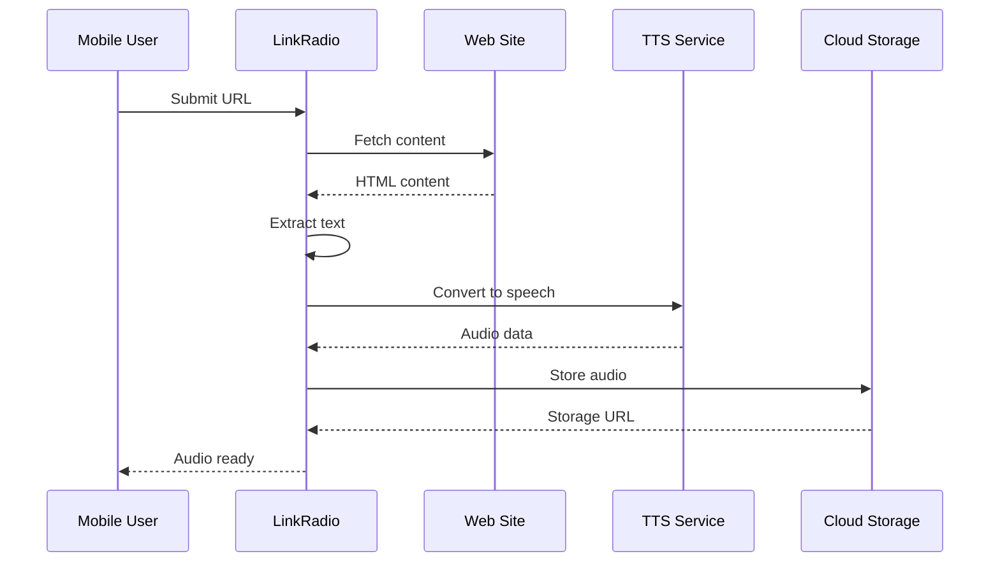
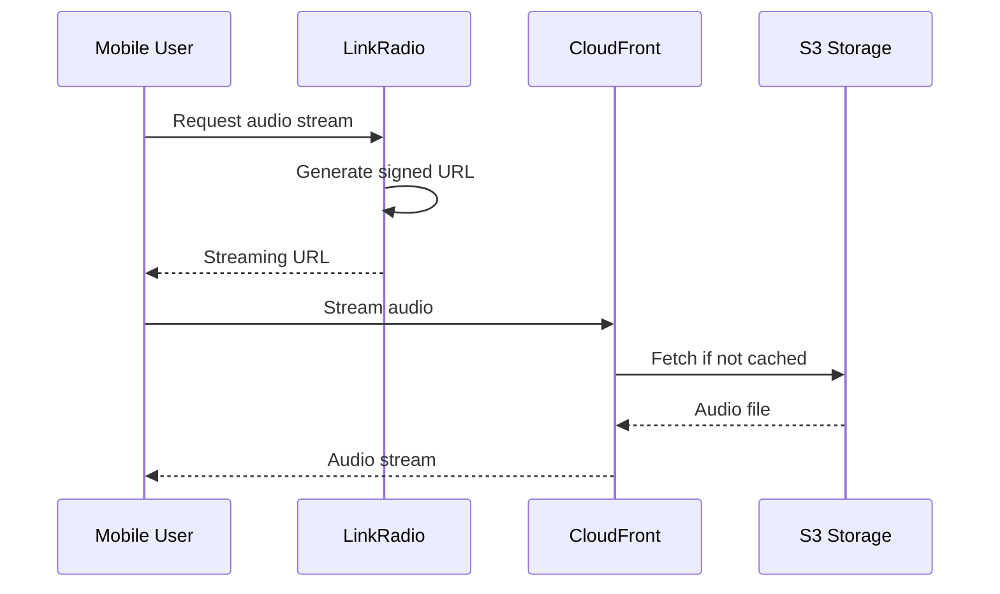
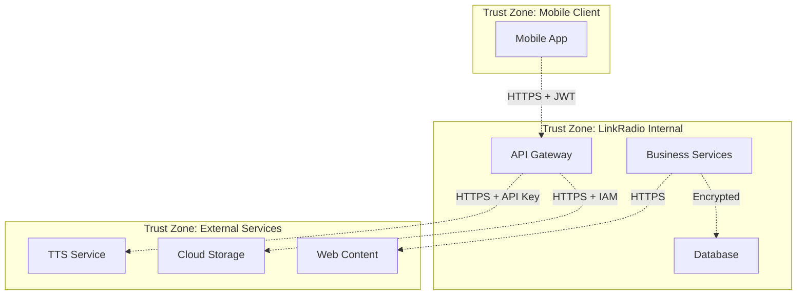

# C4 Model: System Context Diagram

## 📋 개요

이 문서는 LinkRadio 시스템의 **System Context Diagram**을 제공합니다. 이는 C4 모델의 첫 번째 레벨로, 시스템의 경계와 외부 엔티티와의 관계를 보여줍니다.

## 🎯 목적

- 시스템의 전체적인 맥락 이해
- 주요 사용자 그룹 식별
- 외부 시스템 의존성 파악
- 시스템 경계 명확화

## 🌐 System Context Diagram



## 👥 사용자 및 액터

### Primary Users (주요 사용자)

| 사용자 그룹 | 설명 | 주요 니즈 |
|-------------|------|-----------|
| **출퇴근족** | 대중교통 이용자, 운전자 | 이동 시간 활용, 핸즈프리 콘텐츠 소비 |
| **피트니스 애호가** | 운동하는 사람들 | 운동 중 학습, 시간 효율성 |
| **콘텐츠 소비자** | 정보 수집가 | 백로그 관리, 다양한 소스 통합 |
| **전문가/학습자** | 업계 전문가, 학생 | 전문 지식 습득, 지속적 학습 |

### Secondary Users (보조 사용자)

| 사용자 그룹 | 설명 | 상호작용 |
|-------------|------|-----------|
| **콘텐츠 크리에이터** | 블로거, 기자 | 간접적 - 콘텐츠 제공 |
| **시스템 관리자** | DevOps, 운영팀 | 시스템 모니터링, 관리 |

## 🌍 외부 시스템 및 의존성

### 1. Web Content Providers
**역할**: 원본 콘텐츠 제공
- **LinkedIn**: 비즈니스 아티클, 전문가 포스트
- **Medium**: 기술 블로그, 에세이
- **News Sites**: 뉴스 기사, 분석 글
- **Technical Blogs**: 개발 문서, 튜토리얼

**상호작용**:
```
LinkRadio → HTTP GET → Web Content Providers
                   ← HTML Content ←
```

### 2. Text-to-Speech Service
**역할**: 텍스트를 고품질 음성으로 변환

**Provider Options**:
- **Amazon Polly**: AWS 생태계 통합
- **Google Cloud TTS**: 자연스러운 음성
- **Azure Cognitive Services**: 다국어 지원

**상호작용**:
```
LinkRadio → POST /synthesize-speech → TTS Service
                   ← Audio Stream ←
```

### 3. Cloud Storage (AWS S3)
**역할**: 오디오 파일 저장 및 관리
- **버킷 구조**: 사용자별/날짜별 폴더링
- **메타데이터**: 제목, 재생시간, 크기
- **생명주기**: 자동 삭제 정책

### 4. Content Delivery Network (CloudFront)
**역할**: 글로벌 오디오 배포
- **캐싱**: 지역별 캐시 최적화
- **대역폭**: 효율적 스트리밍
- **보안**: Signed URL을 통한 접근 제어

### 5. Authentication Provider
**역할**: 사용자 인증 및 관리
- **소셜 로그인**: Google, Apple, Facebook
- **토큰 관리**: JWT 기반 인증
- **사용자 프로필**: 기본 정보 관리

### 6. Analytics & Monitoring
**역할**: 시스템 관찰성 및 사용량 추적
- **시스템 메트릭**: 성능, 에러율
- **사용자 메트릭**: 변환량, 청취 패턴
- **비즈니스 메트릭**: 성공률, 참여도

## 🔄 주요 상호작용 패턴

### 1. 콘텐츠 변환 플로우


### 2. 오디오 스트리밍 플로우


## 📊 시스템 경계 및 책임

### 시스템 내부 (LinkRadio 책임)
- ✅ 사용자 인터페이스 (모바일 앱)
- ✅ API 게이트웨이 및 비즈니스 로직
- ✅ 콘텐츠 파싱 및 처리
- ✅ 오디오 변환 오케스트레이션
- ✅ 사용자 데이터 관리
- ✅ 플레이리스트 및 라이브러리 관리

### 시스템 외부 (외부 서비스 의존)
- ❌ 원본 웹 콘텐츠 생성 및 호스팅
- ❌ TTS 음성 합성 엔진
- ❌ 클라우드 인프라 관리
- ❌ CDN 네트워크 운영
- ❌ 사용자 인증 인프라

## 🔐 보안 경계



## 📈 확장성 고려사항

### 수평 확장 지점
1. **API Gateway**: Load Balancer 뒤 다중 인스턴스
2. **TTS Service**: 다중 제공업체 및 지역
3. **Storage**: 다중 지역 복제
4. **CDN**: 글로벌 엣지 로케이션

### 수직 확장 제약
1. **TTS Rate Limits**: 제공업체별 제한
2. **Web Scraping**: 사이트별 접근 제한
3. **Storage Costs**: 오디오 파일 크기

## 🚨 위험 요소 및 완화 방안

| 위험 요소 | 영향도 | 완화 방안 |
|-----------|--------|-----------|
| **TTS 서비스 장애** | 높음 | 다중 제공업체, 캐싱 |
| **웹 사이트 차단** | 중간 | 다양한 파싱 전략, User-Agent 로테이션 |
| **CDN 장애** | 중간 | 다중 지역, 자동 페일오버 |
| **스토리지 비용** | 중간 | 자동 정리, 압축 |
| **저작권 문제** | 높음 | 사용자 교육, 정책 준수 |

---

*문서 버전: 1.0*
*마지막 업데이트: 2025-09-28*
*검토자: System Architect*