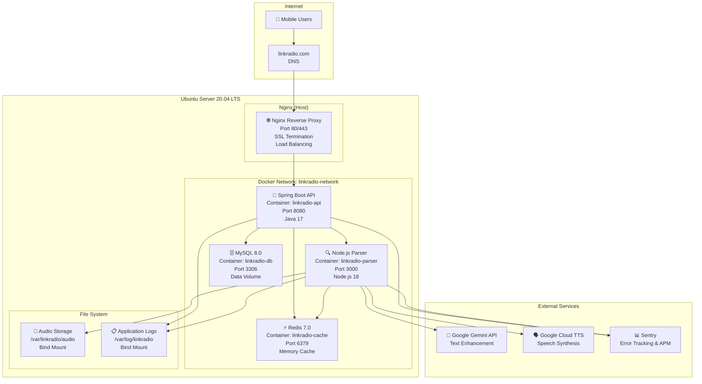

# LinkRadio 배포 아키텍처

## 📋 개요

LinkRadio 시스템의 우분투 서버 + Docker 기반 배포 아키텍처를 정의합니다. Gemini + Google TTS + Sentry 통합 스택을 활용한 production-ready 배포 환경을 구성합니다.

## 🏗️ 배포 아키텍처 다이어그램



## 🐳 Docker Compose 구성

### docker-compose.yml
```yaml
version: '3.8'

services:
  # Spring Boot API 서비스
  linkradio-api:
    build:
      context: .
      dockerfile: Dockerfile
    container_name: linkradio-api
    restart: unless-stopped
    ports:
      - "8080:8080"
    environment:
      - SPRING_PROFILES_ACTIVE=production
      - DB_HOST=linkradio-db
      - DB_PORT=3306
      - DB_NAME=linkradio
      - DB_USERNAME=${DB_USERNAME}
      - DB_PASSWORD=${DB_PASSWORD}
      - REDIS_HOST=linkradio-cache
      - REDIS_PORT=6379
      - REDIS_PASSWORD=${REDIS_PASSWORD}
      - PARSING_SERVER_URL=http://linkradio-parser:3000
      - SENTRY_DSN=${SENTRY_DSN}
      - JWT_SECRET=${JWT_SECRET}
    volumes:
      - /var/log/linkradio:/app/logs
      - /var/linkradio/audio:/app/audio:ro
    depends_on:
      - linkradio-db
      - linkradio-cache
    networks:
      - linkradio-network
    healthcheck:
      test: ["CMD", "curl", "-f", "http://localhost:8080/actuator/health"]
      interval: 30s
      timeout: 10s
      retries: 3

  # Node.js 파싱 서버
  linkradio-parser:
    build:
      context: ./parsing-server
      dockerfile: Dockerfile
    container_name: linkradio-parser
    restart: unless-stopped
    ports:
      - "3000:3000"
    environment:
      - NODE_ENV=production
      - REDIS_HOST=linkradio-cache
      - REDIS_PORT=6379
      - REDIS_PASSWORD=${REDIS_PASSWORD}
      - GOOGLE_APPLICATION_CREDENTIALS=/app/credentials/gcp-service-account.json
      - GEMINI_API_KEY=${GEMINI_API_KEY}
      - SENTRY_DSN=${SENTRY_DSN_PARSER}
      - AUDIO_STORAGE_PATH=/app/audio
      - MAX_CONCURRENT_BROWSERS=3
    volumes:
      - /var/log/linkradio:/app/logs
      - /var/linkradio/audio:/app/audio
      - ./credentials/gcp-service-account.json:/app/credentials/gcp-service-account.json:ro
    depends_on:
      - linkradio-cache
    networks:
      - linkradio-network
    healthcheck:
      test: ["CMD", "curl", "-f", "http://localhost:3000/health"]
      interval: 30s
      timeout: 10s
      retries: 3

  # MySQL 데이터베이스
  linkradio-db:
    image: mysql:8.0
    container_name: linkradio-db
    restart: unless-stopped
    environment:
      - MYSQL_ROOT_PASSWORD=${DB_ROOT_PASSWORD}
      - MYSQL_DATABASE=linkradio
      - MYSQL_USER=${DB_USERNAME}
      - MYSQL_PASSWORD=${DB_PASSWORD}
      - MYSQL_CHARACTER_SET_SERVER=utf8mb4
      - MYSQL_COLLATION_SERVER=utf8mb4_unicode_ci
    volumes:
      - linkradio-db-data:/var/lib/mysql
      - ./database/init:/docker-entrypoint-initdb.d
    ports:
      - "3306:3306"
    networks:
      - linkradio-network
    command: --default-authentication-plugin=mysql_native_password
    healthcheck:
      test: ["CMD", "mysqladmin", "ping", "-h", "localhost", "-u", "root", "-p${DB_ROOT_PASSWORD}"]
      interval: 30s
      timeout: 10s
      retries: 3

  # Redis 캐시
  linkradio-cache:
    image: redis:7-alpine
    container_name: linkradio-cache
    restart: unless-stopped
    command: redis-server --requirepass ${REDIS_PASSWORD} --maxmemory 512mb --maxmemory-policy allkeys-lru
    ports:
      - "6379:6379"
    volumes:
      - linkradio-cache-data:/data
    networks:
      - linkradio-network
    healthcheck:
      test: ["CMD", "redis-cli", "--raw", "incr", "ping"]
      interval: 30s
      timeout: 3s
      retries: 3

volumes:
  linkradio-db-data:
    driver: local
  linkradio-cache-data:
    driver: local

networks:
  linkradio-network:
    driver: bridge
```

### 환경 변수 설정 (.env)
```bash
# 데이터베이스 설정
DB_USERNAME=linkradio_user
DB_PASSWORD=your_secure_db_password
DB_ROOT_PASSWORD=your_secure_root_password

# Redis 설정
REDIS_PASSWORD=your_secure_redis_password

# JWT 설정
JWT_SECRET=your_jwt_secret_key_256_bits

# Google Cloud 설정
GEMINI_API_KEY=your_gemini_api_key
GOOGLE_APPLICATION_CREDENTIALS=/app/credentials/gcp-service-account.json

# Sentry 설정
SENTRY_DSN=https://your-sentry-dsn@sentry.io/project-id
SENTRY_DSN_PARSER=https://your-parser-sentry-dsn@sentry.io/project-id

# 애플리케이션 설정
SPRING_PROFILES_ACTIVE=production
NODE_ENV=production
```

## 🌐 Nginx 설정

### /etc/nginx/sites-available/linkradio
```nginx
# Rate limiting
limit_req_zone $binary_remote_addr zone=api:10m rate=10r/s;
limit_req_zone $binary_remote_addr zone=parser:10m rate=5r/s;

# Upstream 설정
upstream linkradio_api {
    server localhost:8080 max_fails=3 fail_timeout=30s;
}

upstream linkradio_parser {
    server localhost:3000 max_fails=3 fail_timeout=30s;
}

# HTTPS 리디렉션
server {
    listen 80;
    server_name linkradio.com www.linkradio.com;
    return 301 https://$server_name$request_uri;
}

# 메인 서버 설정
server {
    listen 443 ssl http2;
    server_name linkradio.com www.linkradio.com;

    # SSL 설정
    ssl_certificate /etc/letsencrypt/live/linkradio.com/fullchain.pem;
    ssl_certificate_key /etc/letsencrypt/live/linkradio.com/privkey.pem;
    ssl_protocols TLSv1.2 TLSv1.3;
    ssl_ciphers ECDHE-RSA-AES256-GCM-SHA512:DHE-RSA-AES256-GCM-SHA512;
    ssl_prefer_server_ciphers off;
    ssl_session_cache shared:SSL:10m;

    # 보안 헤더
    add_header X-Frame-Options DENY;
    add_header X-Content-Type-Options nosniff;
    add_header X-XSS-Protection "1; mode=block";
    add_header Strict-Transport-Security "max-age=31536000; includeSubdomains; preload";

    # 클라이언트 설정
    client_max_body_size 10M;
    client_body_timeout 60s;
    client_header_timeout 60s;

    # Gzip 압축
    gzip on;
    gzip_vary on;
    gzip_min_length 1024;
    gzip_types text/plain application/json application/javascript text/css application/xml;

    # API 프록시 (Spring Boot)
    location /api/ {
        limit_req zone=api burst=20 nodelay;

        proxy_pass http://linkradio_api;
        proxy_set_header Host $host;
        proxy_set_header X-Real-IP $remote_addr;
        proxy_set_header X-Forwarded-For $proxy_add_x_forwarded_for;
        proxy_set_header X-Forwarded-Proto $scheme;

        proxy_connect_timeout 5s;
        proxy_send_timeout 60s;
        proxy_read_timeout 60s;

        # CORS 헤더
        add_header Access-Control-Allow-Origin "*";
        add_header Access-Control-Allow-Methods "GET, POST, PUT, DELETE, OPTIONS";
        add_header Access-Control-Allow-Headers "Content-Type, Authorization";
    }

    # 파서 API (내부 전용, 외부 접근 차단)
    location /parser/ {
        deny all;
        return 403;
    }

    # 오디오 파일 서빙
    location /audio/ {
        alias /var/linkradio/audio/;
        expires 1d;
        add_header Cache-Control "public, immutable";

        # 보안: 직접 접근 제한
        location ~* \.(mp3|wav|ogg)$ {
            # JWT 토큰 검증을 위한 auth_request 모듈 사용 가능
            try_files $uri =404;
        }
    }

    # 정적 파일 (향후 웹 인터페이스용)
    location /static/ {
        alias /var/linkradio/static/;
        expires 7d;
        add_header Cache-Control "public, immutable";
    }

    # 헬스체크
    location /health {
        access_log off;
        proxy_pass http://linkradio_api/actuator/health;
    }

    # 기본 페이지
    location / {
        return 200 '{"status":"LinkRadio API Server","version":"1.0"}';
        add_header Content-Type application/json;
    }
}
```

## 🚀 배포 스크립트

### deploy.sh
```bash
#!/bin/bash

set -e

echo "🚀 LinkRadio 배포 시작..."

# 환경 변수 확인
if [ ! -f .env ]; then
    echo "❌ .env 파일이 없습니다."
    exit 1
fi

# Docker 및 Docker Compose 확인
command -v docker >/dev/null 2>&1 || { echo "❌ Docker가 설치되지 않았습니다." >&2; exit 1; }
command -v docker-compose >/dev/null 2>&1 || { echo "❌ Docker Compose가 설치되지 않았습니다." >&2; exit 1; }

# 필요한 디렉터리 생성
echo "📁 디렉터리 구조 생성..."
sudo mkdir -p /var/linkradio/audio
sudo mkdir -p /var/log/linkradio
sudo chown -R $USER:$USER /var/linkradio
sudo chown -R $USER:$USER /var/log/linkradio

# Google Cloud 서비스 계정 키 확인
if [ ! -f credentials/gcp-service-account.json ]; then
    echo "❌ Google Cloud 서비스 계정 키 파일이 없습니다."
    echo "credentials/gcp-service-account.json 파일을 추가해주세요."
    exit 1
fi

# 이전 컨테이너 정리
echo "🧹 이전 배포 정리..."
docker-compose down --remove-orphans

# 새 이미지 빌드
echo "🔨 Docker 이미지 빌드..."
docker-compose build --no-cache

# 컨테이너 시작
echo "🐳 컨테이너 시작..."
docker-compose up -d

# 헬스체크 대기
echo "⏳ 서비스 시작 대기..."
sleep 30

# 헬스체크 실행
echo "🔍 헬스체크 수행..."
for service in linkradio-api linkradio-parser linkradio-db linkradio-cache; do
    echo "Checking $service..."
    if docker-compose ps | grep $service | grep -q "Up"; then
        echo "✅ $service is running"
    else
        echo "❌ $service failed to start"
        docker-compose logs $service
        exit 1
    fi
done

# API 응답 테스트
echo "🧪 API 응답 테스트..."
if curl -f http://localhost:8080/actuator/health > /dev/null 2>&1; then
    echo "✅ Spring Boot API is responding"
else
    echo "❌ Spring Boot API is not responding"
    exit 1
fi

if curl -f http://localhost:3000/health > /dev/null 2>&1; then
    echo "✅ Node.js Parser is responding"
else
    echo "❌ Node.js Parser is not responding"
    exit 1
fi

echo "🎉 배포 완료!"
echo ""
echo "📊 서비스 상태:"
docker-compose ps

echo ""
echo "📝 로그 확인:"
echo "  전체 로그: docker-compose logs -f"
echo "  API 로그: docker-compose logs -f linkradio-api"
echo "  파서 로그: docker-compose logs -f linkradio-parser"

echo ""
echo "🔧 유용한 명령어:"
echo "  서비스 재시작: docker-compose restart [service-name]"
echo "  로그 실시간 확인: docker-compose logs -f [service-name]"
echo "  컨테이너 정지: docker-compose down"
```

## 📊 모니터링 및 로깅

### Sentry 설정
```javascript
// Node.js Parser에서 Sentry 설정
const Sentry = require("@sentry/node");
const { ProfilingIntegration } = require("@sentry/profiling-node");

Sentry.init({
  dsn: process.env.SENTRY_DSN_PARSER,
  integrations: [
    new ProfilingIntegration(),
  ],
  tracesSampleRate: 1.0,
  profilesSampleRate: 1.0,
  environment: process.env.NODE_ENV,
  beforeSend: (event) => {
    // 민감한 정보 필터링
    if (event.request?.data) {
      delete event.request.data.apiKey;
    }
    return event;
  }
});
```

### 로그 관리
```yaml
# docker-compose.yml에 로그 설정 추가
logging:
  driver: "json-file"
  options:
    max-size: "100m"
    max-file: "5"
```

## 🔧 유지보수 작업

### 백업 스크립트 (backup.sh)
```bash
#!/bin/bash

BACKUP_DIR="/var/backups/linkradio"
DATE=$(date +%Y%m%d_%H%M%S)

# 데이터베이스 백업
docker exec linkradio-db mysqldump -u root -p$DB_ROOT_PASSWORD linkradio > $BACKUP_DIR/db_backup_$DATE.sql

# 오디오 파일 백업 (rsync 사용)
rsync -av /var/linkradio/audio/ $BACKUP_DIR/audio_backup_$DATE/

# 구 백업 파일 정리 (7일 이상)
find $BACKUP_DIR -name "*.sql" -mtime +7 -delete
find $BACKUP_DIR -name "audio_backup_*" -mtime +7 -exec rm -rf {} \;
```

### 업데이트 스크립트 (update.sh)
```bash
#!/bin/bash

echo "🔄 LinkRadio 업데이트 시작..."

# Git pull
git pull origin main

# 이미지 재빌드
docker-compose build --no-cache

# 롤링 업데이트
docker-compose up -d --force-recreate

echo "✅ 업데이트 완료!"
```

## 📋 운영 체크리스트

### 일일 확인사항
- [ ] 컨테이너 상태 확인: `docker-compose ps`
- [ ] 디스크 사용량 확인: `df -h`
- [ ] 로그 에러 확인: `docker-compose logs --since=24h | grep ERROR`
- [ ] Sentry 대시보드 확인

### 주간 확인사항
- [ ] 데이터베이스 백업 수행
- [ ] 오디오 파일 스토리지 사용량 확인
- [ ] SSL 인증서 만료일 확인: `certbot certificates`
- [ ] 시스템 업데이트: `apt update && apt upgrade`

### 월간 확인사항
- [ ] Google Cloud TTS 사용량 및 비용 확인
- [ ] Gemini API 사용량 확인
- [ ] 로그 파일 정리 및 압축
- [ ] 성능 지표 리뷰 및 최적화

---

*문서 버전: 1.0*
*마지막 업데이트: 2025-09-28*
*검토자: DevOps Team*