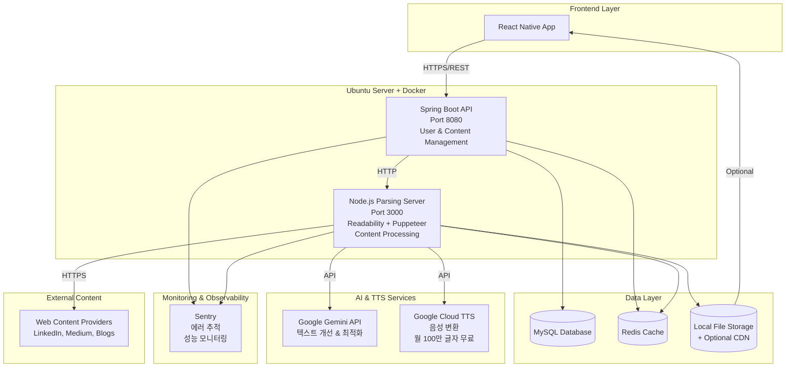
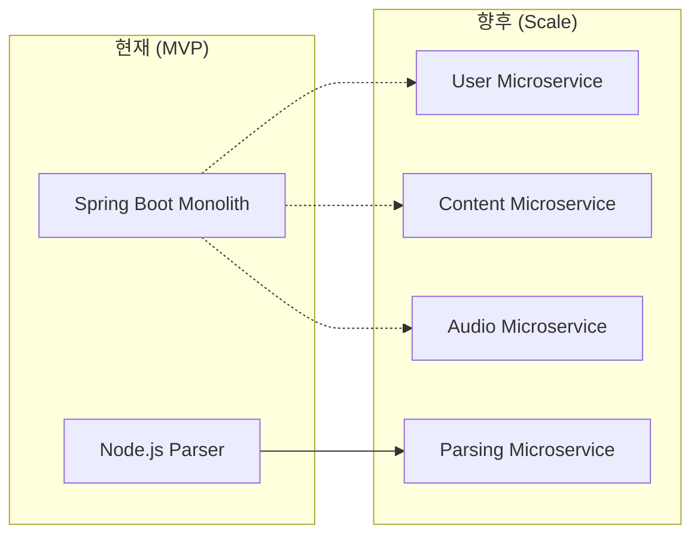
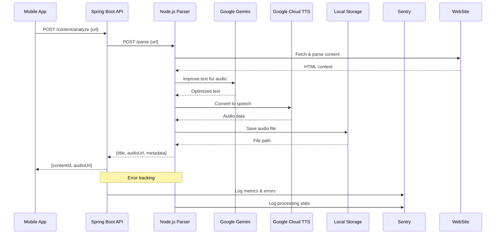
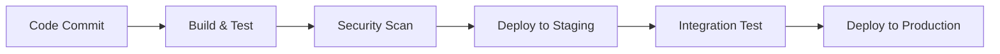

# LinkRadio 시스템 개요

## 📊 시스템 요약

**LinkRadio**는 사용자가 제공한 웹 링크의 텍스트 콘텐츠를 추출하여 고품질 음성으로 변환하고, 라디오와 같은 청취 경험을 제공하는 플랫폼입니다.

### 핵심 가치 제안
- **핸즈프리 학습**: 출퇴근, 운동 중 콘텐츠 소비
- **콘텐츠 중앙화**: 다양한 소스의 아티클을 하나의 오디오 라이브러리로 통합
- **시간 효율성**: 멀티태스킹을 통한 생산성 향상

## 🏗️ 아키텍처 개요

LinkRadio는 **하이브리드 아키텍처**를 채택합니다:
- **MVP 단계**: 모놀리식 Spring Boot 애플리케이션
- **확장 단계**: 마이크로서비스로 점진적 분리
- **특화 서비스**: Node.js 기반 웹 파싱 서버

## 🎯 시스템 목표

### 기능적 목표
1. **콘텐츠 처리**: 웹 링크에서 텍스트 추출 (90% 이상 성공률)
2. **음성 변환**: 자연스러운 TTS 변환 (30초 이내 처리)
3. **사용자 경험**: 직관적인 라디오 스타일 인터페이스
4. **콘텐츠 관리**: 플레이리스트 및 라이브러리 관리

### 비기능적 목표
1. **성능**: 1000단어 기사 30초 이내 변환
2. **확장성**: 10,000+ 동시 사용자 지원
3. **가용성**: 99.9% 업타임
4. **보안**: 개인정보 보호 및 콘텐츠 정책 준수

## 👥 주요 이해관계자

### 내부 이해관계자
- **Product Team**: 제품 기획 및 사용자 경험
- **Engineering Team**: 시스템 개발 및 운영
- **DevOps Team**: 인프라 및 배포 관리

### 외부 이해관계자
- **End Users**: 모바일 앱 사용자
- **Content Providers**: 웹사이트 및 블로그 운영자
- **TTS Service Providers**: Amazon Polly, Google Cloud TTS
- **Cloud Infrastructure Providers**: AWS

## 🔧 핵심 기술 스택

### Backend Services
- **Primary**: Spring Boot 3.5+ (Java 17)
- **Parsing**: Node.js 18+ with Express.js
- **Database**: MySQL 8.0
- **Cache**: Redis 7.0
- **Storage**: Local File System (+ Optional CDN)
- **Deployment**: Docker on Ubuntu Server

### External Services
- **AI/텍스트 개선**: Google Gemini API
- **TTS**: Google Cloud Text-to-Speech (월 100만 글자 무료)
- **Web Parsing**: Readability.js + Puppeteer
- **Monitoring**: Sentry (에러 추적 & 성능)

### Frontend
- **Mobile**: React Native
- **Platform**: iOS, Android

## 📊 시스템 특성

### 확장성 패턴

### 데이터 플로우

## 🔐 보안 고려사항

### 인증 및 인가
- **JWT 기반 인증**: Stateless 토큰 관리
- **Role-based Access**: 사용자 권한 관리
- **Rate Limiting**: API 남용 방지

### 데이터 보호
- **HTTPS/TLS**: 모든 통신 암호화
- **데이터 암호화**: 민감 정보 저장 암호화
- **개인정보**: GDPR/CCPA 준수

## 📈 모니터링 및 관찰성

### 메트릭 수집
- **시스템 메트릭**: CPU, Memory, Network
- **애플리케이션 메트릭**: API 응답시간, 에러율
- **비즈니스 메트릭**: 변환 성공률, 사용자 참여도

### 로깅 전략
- **구조화된 로깅**: JSON 형태
- **에러 추적**: Sentry를 통한 실시간 에러 모니터링
- **성능 모니터링**: Sentry Performance Monitoring
- **중앙화된 로그**: Docker 로그 + Sentry

## 🚀 배포 전략

### 환경 구성
- **Development**: 로컬 Docker Compose
- **Staging**: Ubuntu Server + Docker
- **Production**: Ubuntu Server + Docker + Nginx Reverse Proxy

### CI/CD 파이프라인

## 📝 품질 속성

| 속성 | 목표 | 측정 방법 |
|------|------|-----------|
| **성능** | 30초 이내 TTS 변환 | 응답 시간 모니터링 |
| **확장성** | 10K 동시 사용자 | 로드 테스트 |
| **가용성** | 99.9% 업타임 | SLA 모니터링 |
| **신뢰성** | 90% 파싱 성공률 | 에러율 추적 |
| **보안** | 0건 보안 사고 | 보안 감사 |
| **사용성** | 3탭 이내 변환 | UX 테스트 |

## 🔮 향후 로드맵

### Phase 1 (MVP - 3개월)
- [x] Spring Boot 기본 구조
- [x] PRD 및 아키텍처 설계
- [ ] Node.js 파싱 서버 구현
- [ ] 기본 TTS 통합
- [ ] 모바일 앱 프로토타입

### Phase 2 (확장 - 6개월)
- [ ] 사용자 관리 시스템
- [ ] 플레이리스트 기능
- [ ] 오프라인 지원
- [ ] 성능 최적화

### Phase 3 (스케일 - 12개월)
- [ ] 마이크로서비스 분리
- [ ] AI 기반 콘텐츠 추천
- [ ] 멀티 언어 지원
- [ ] 엔터프라이즈 기능

---

*문서 버전: 1.0*
*마지막 업데이트: 2025-09-28*
*작성자: Backend Architecture Team*